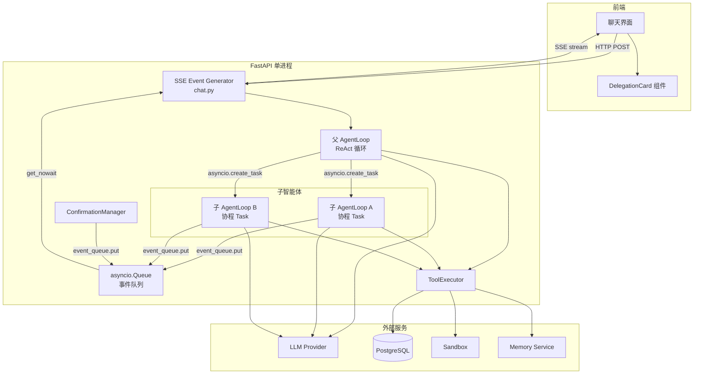
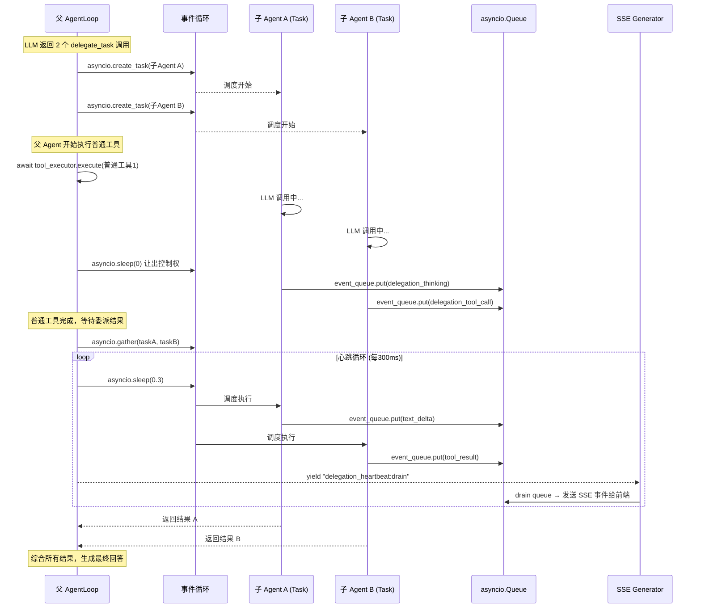
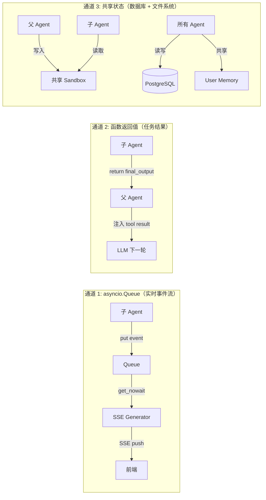
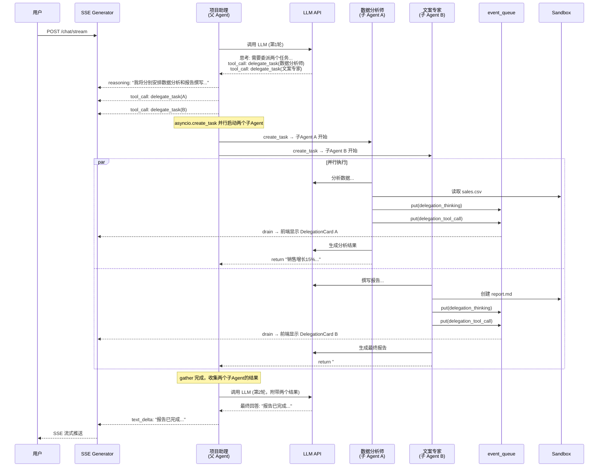
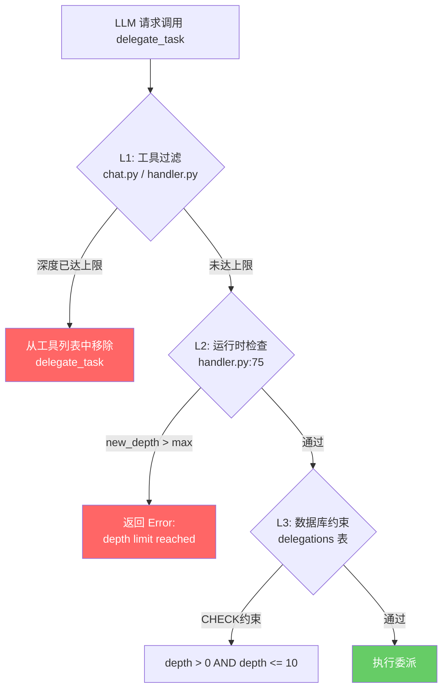
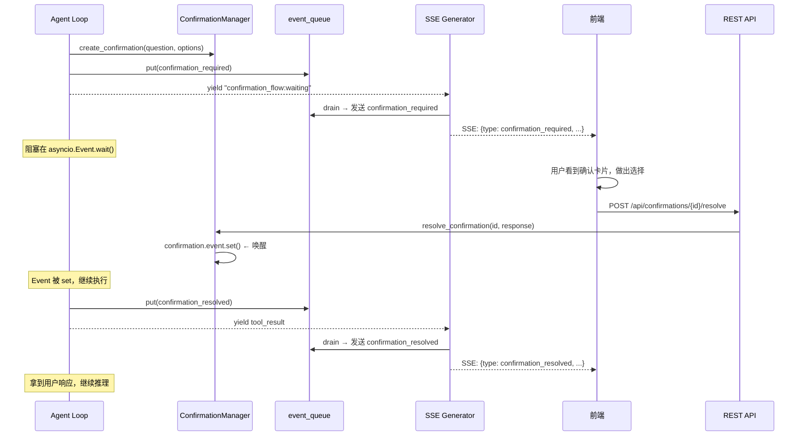
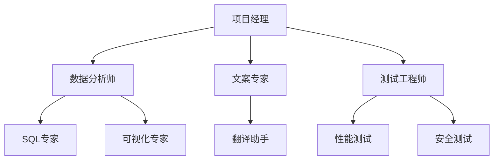
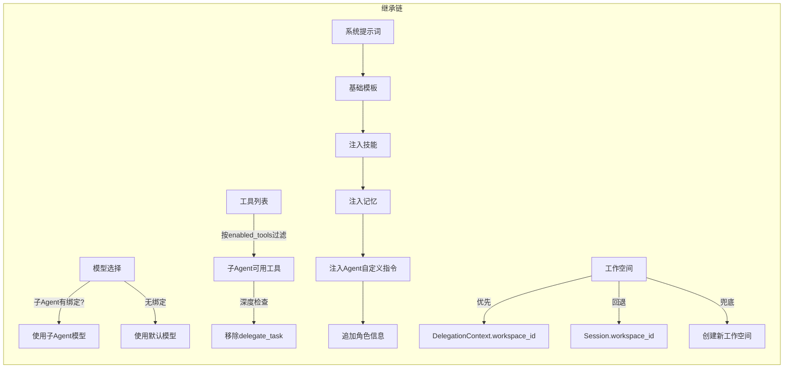

# 多智能体技术实现详解

> 本文档详细说明多智能体系统的并发模型、数据交互机制和完整执行流程。

---

## 1. 核心结论：单线程异步协作（非多线程、非多进程）

本系统的多智能体实现**不使用多线程，也不使用多进程**，而是基于 Python **asyncio 协程** 的**协作式多任务**模型。

| 并发方案 | 是否使用 | 原因 |
|---|---|---|
| `threading` (多线程) | **否** | GIL 限制 + 异步IO库不兼容 |
| `multiprocessing` (多进程) | **否** | 进程间通信开销大，不适合高频事件传递 |
| `asyncio` (协程) | **是** | 单线程内高效调度，零切换开销，天然适配 LLM 流式调用 |

### 为什么选择 asyncio？

1. **LLM 调用本质是 I/O 密集型**：90% 时间在等待 API 响应，协程切换几乎无开销
2. **SSE 流式推送需要细粒度控制**：`async for` 和 `yield` 天然适配流式事件
3. **事件传递零拷贝**：`asyncio.Queue` 在同一个事件循环内传递对象引用，无需序列化
4. **避免并发复杂性**：无锁竞争、无死锁风险、无 GIL 问题

---

## 2. 系统架构总览



**关键理解**：图中所有组件运行在**同一个线程**中，通过 `asyncio` 事件循环进行协作调度。

---

## 3. 并发模型详解

### 3.1 asyncio 协作式调度

```
┌─────────────────── 单线程（事件循环）───────────────────┐
│                                                        │
│   ┌──────────┐    yield    ┌──────────────┐            │
│   │ 父 Agent │ ──────────> │ 子 Agent A   │            │
│   │  Loop    │ <────────── │ (协程 Task)  │            │
│   └──────────┘    yield    └──────────────┘            │
│        │                             │                  │
│        │         yield               │                  │
│        │    ┌──────────────┐         │                  │
│        └──> │ 子 Agent B   │ <───────┘                  │
│             │ (协程 Task)  │                            │
│             └──────────────┘                            │
│                    │                                    │
│              yield │ yield                              │
│             ┌──────v──────┐                             │
│             │ SSE Generator│ ──> 前端                    │
│             └─────────────┘                             │
└────────────────────────────────────────────────────────┘
```

**调度原语对照表**：

| asyncio 原语 | 用途 | 代码位置 |
|---|---|---|
| `asyncio.create_task()` | 启动子智能体后台执行 | `agent.py:285` |
| `asyncio.Queue` | 跨协程事件传递 | `agent.py:32`, `chat.py:894` |
| `asyncio.gather()` | 等待多个子智能体完成 | `agent.py:372` |
| `asyncio.Event` | 用户确认的阻塞/唤醒 | `confirmation.py:27` |
| `asyncio.wait_for()` | 确认超时控制 | `confirmation.py:85` |
| `asyncio.sleep(0)` | 主动让出控制权 | `agent.py:364` |
| `async for` / `yield` | SSE 流式事件生成 | `agent.py:139`, `chat.py:1018` |

### 3.2 并行委派执行时序

当父智能体同时委派多个任务时，执行顺序如下：



---

## 4. 数据交互机制

### 4.1 三种数据交互通道



#### 通道 1：asyncio.Queue — 实时事件流

子智能体在运行过程中产生的所有中间事件，通过 `asyncio.Queue` 实时推送到前端的 SSE 流：

```python
# 子 Agent 写入事件 (delegation/handler.py:403-454)
async def _proxy_child_event(event_queue, delegation_id, event):
    if event.startswith("reasoning:"):
        await event_queue.put({
            "type": "delegation_thinking",
            "delegation_id": str(delegation_id),
            "content": event[len("reasoning:"):],
        })
    elif event.startswith("tool_call:"):
        # ... 解析并推入队列

# SSE Generator 消费事件 (chat.py:1025-1034)
while not event_queue.empty():
    del_event = event_queue.get_nowait()
    yield _sse_event(del_event)  # 推送给前端
```

**事件类型一览**：

| 事件类型 | 方向 | 说明 |
|---|---|---|
| `delegation_start` | 子 → 前端 | 子智能体开始执行 |
| `delegation_thinking` | 子 → 前端 | 子智能体的推理过程 |
| `delegation_tool_call` | 子 → 前端 | 子智能体调用工具 |
| `delegation_tool_result` | 子 → 前端 | 子智能体工具结果 |
| `delegation_text_delta` | 子 → 前端 | 子智能体的流式文本输出 |
| `delegation_end` | 子 → 前端 | 子智能体执行完成/失败 |
| `delegation_heartbeat` | 父 → 前端 | 心跳信号，表示委派仍在进行 |
| `confirmation_required` | Agent → 前端 | 需要用户确认 |
| `confirmation_resolved` | 前端 → Agent | 用户已响应 |

#### 通道 2：函数返回值 — 任务结果

子智能体的最终输出通过标准的 Python 函数调用链返回给父智能体：

```
子 AgentLoop.run()
  → 返回 final_output (str)
    → handle_delegate_task() return
      → ToolExecutor.execute() return ToolResult
        → 注入父 Agent 的 messages 列表
          → LLM 看到工具结果，综合生成最终回答
```

```python
# 子 Agent 执行并返回结果 (handler.py:197-211)
async for event in child_loop.run(user_input=user_input, ...):
    if isinstance(event, AgentStep):
        if event.done:
            final_output = event.final_output

# ... 更新数据库 ...
return final_output  # 返回给父 Agent 作为 tool result
```

#### 通道 3：共享状态

| 共享资源 | 说明 | 继承方式 |
|---|---|---|
| **Sandbox（文件系统）** | 父子共享同一个 workspace | `workspace_id` 通过 `DelegationContext` 传递 |
| **User Memory** | 三层记忆（L1/L2/L3）按 `user_id` 共享 | 所有 Agent 共享同一 `user_id` |
| **PostgreSQL** | Delegation 记录、Agent 配置等 | 同一数据库连接池 |
| **Session 历史** | 子 Agent **不继承**父 Agent 的对话历史 | `conversation_history=[]` |

### 4.2 核心数据结构

#### DelegationContext — 委派上下文

```python
# agent.py:26-33
@dataclass
class DelegationContext:
    parent_agent_id: UUID          # 当前 Agent 的 ID
    delegation_depth: int          # 当前嵌套深度 (0=顶层)
    max_depth: int                 # 最大允许深度 (默认 3)
    event_queue: asyncio.Queue     # 事件队列引用（共享）
    workspace_id: UUID | None      # 共享工作空间 ID
```

这个结构在**每次委派时传递**，子智能体继承父智能体的 `event_queue` 和 `workspace_id`，实现事件流和文件系统的共享。

#### Delegation 数据库记录

```python
# models.py:796-821
class Delegation(Base):
    __tablename__ = "delegations"

    parent_session_id   # 所属会话
    parent_agent_id     # 父 Agent ID
    child_agent_id      # 子 Agent ID
    depth               # 嵌套深度
    task                # 任务描述
    context             # 附加上下文
    status              # running → completed / failed / timeout
    result              # 最终输出
    error               # 错误信息
    token_usage         # Token 消耗
    duration_ms         # 执行耗时
```

---

## 5. 完整执行流程示例

### 5.1 场景：用户要求"帮我写一个报告"

假设父 Agent "项目助理" 有两个子 Agent："数据分析师" 和 "文案专家"。

```
用户: "帮我分析最近的销售数据，并写一份季度报告"
```

#### 执行流程



#### 对应的代码执行路径

```
1. chat.py:stream_chat()
   │
   ├── 创建 event_queue = asyncio.Queue()           # chat.py:894
   ├── 创建 DelegationContext(depth=0)               # chat.py:896
   ├── 构建 AgentLoop                               # chat.py:905
   │
   └── async for event in agent_loop.run():          # chat.py:1018
       │
       ├── LLM 返回 2 个 delegate_task 调用
       │
       ├── [agent.py:285] asyncio.create_task(子Agent A)  ← 后台启动
       ├── [agent.py:285] asyncio.create_task(子Agent B)  ← 后台启动
       │
       ├── [agent.py:372] asyncio.gather(taskA, taskB)    ← 等待结果
       │     │
       │     ├── handle_delegate_task(A)                  # handler.py:36
       │     │     ├── 验证父子关系                         # handler.py:86
       │     │     ├── 创建 Delegation 记录                 # handler.py:94
       │     │     ├── event_queue.put(delegation_start)    # handler.py:112
       │     │     ├── 构建子 AgentLoop                     # handler.py:174
       │     │     ├── async for event in child_loop.run()  # handler.py:197
       │     │     │     └── _proxy_child_event()           # handler.py:403
       │     │     └── return final_output                  # handler.py:241
       │     │
       │     └── handle_delegate_task(B)                    # 同上，并行执行
       │
       ├── [chat.py:1025] while not event_queue.empty():   ← 排空队列
       │     └── yield _sse_event(del_event)               ← 推送给前端
       │
       └── [chat.py:1166] yield final text                 ← 最终输出
```

---

## 6. 深度保护机制

系统通过三层防护避免无限嵌套：



**默认配置**：

```python
# config.py:60-68
max_delegation_depth = 3      # 最大嵌套深度
child_max_iterations = 10     # 子 Agent 最大 ReAct 迭代次数
delegation_timeout = 300      # 单次委派超时 (秒)
max_iterations = 20           # 父 Agent 最大迭代次数
```

**深度示例**：

```
用户 → 项目助理(depth=0)
         ├→ 数据分析师(depth=1)
         │    └→ SQL专家(depth=2)
         │         └→ 不能再委派 (depth=3 >= max_depth=3)
         └→ 文案专家(depth=1)
              └→ 翻译助手(depth=2)
                   └→ 不能再委派
```

---

## 7. 用户确认流程（AskUserQuestion）

当智能体需要用户做决定时，会通过 `asyncio.Event` 实现暂停/恢复：



**核心代码**：

```python
# confirmation.py — 全局单例，纯内存存储
class ConfirmationManager:
    def create_confirmation(self, ...):
        confirmation = PendingConfirmation(
            event=asyncio.Event(),  # 核心：可 await 的事件
        )
        self._pending[confirmation.id] = confirmation
        return confirmation

    async def wait_for_response(self, confirmation_id):
        confirmation = self._pending.get(confirmation_id)
        # 阻塞等待，支持超时
        await asyncio.wait_for(
            confirmation.event.wait(),
            timeout=confirmation.timeout_seconds,
        )
        return confirmation

    def resolve_confirmation(self, confirmation_id, response):
        confirmation = self._pending.get(confirmation_id)
        confirmation.response = response
        confirmation.event.set()  # 唤醒等待的协程
```

---

## 8. Agent 层级关系（DAG）

智能体之间通过数据库的多对多关系表组织成 **DAG（有向无环图）**：



**数据库模型**：

```python
# models.py:309-331
class AgentRelationship(Base):
    __tablename__ = "agent_relationships"

    parent_id: UUID   # 父 Agent
    child_id: UUID    # 子 Agent

    # 支持多对多：
    # - 一个 Agent 可以有多个父级
    # - 一个 Agent 可以有多个子级
    # - 写入时检测环路（BFS 向上遍历）
```

**环路检测**：在建立关系时，通过 BFS 从目标子节点向上遍历，检测是否会形成环路：

```python
# agents.py:518-547 — 环路检测
async def _would_create_cycle(db, parent_id, child_id):
    visited = set()
    queue = [child_id]
    while queue:
        current = queue.pop(0)
        if current == parent_id:
            return True  # 会形成环路
        # 查询 current 的所有父节点
        parents = await db.execute(...)
        for p in parents:
            if p not in visited:
                visited.add(p)
                queue.append(p)
    return False
```

---

## 9. 智能体继承机制

子智能体在创建时会进行多层继承：



---

## 10. 性能特性

| 指标 | 数值 | 说明 |
|---|---|---|
| 最大并发子 Agent | 无硬限制 | 受限于 LLM API 并发和内存 |
| 单次委派内存开销 | ~1MB | AgentLoop 实例 + 消息列表 |
| 协程切换延迟 | < 1μs | 纯 Python 协程调度 |
| 事件队列吞吐量 | ~10万/秒 | asyncio.Queue 单生产者 |
| 心跳间隔 | 300ms | 每 300ms drain 一次队列 |

### 与传统多线程方案的对比

| 维度 | 本方案 (asyncio) | 多线程方案 | 多进程方案 |
|---|---|---|---|
| 并发单元 | 协程 (coroutine) | 线程 (thread) | 进程 (process) |
| 内存开销 | 极低 (~1MB/Agent) | 中 (~8MB/线程栈) | 高 (~50MB/进程) |
| 切换开销 | < 1μs | ~10μs | ~100μs |
| 通信方式 | Queue (引用传递) | Queue (序列化) | Pipe/Queue (序列化) |
| 锁竞争 | 无 | 需要 | 无 (独立内存) |
| GIL 影响 | 不受影响 | 受限 | 不受影响 |
| 适用场景 | I/O 密集 | I/O 密集 | CPU 密集 |
