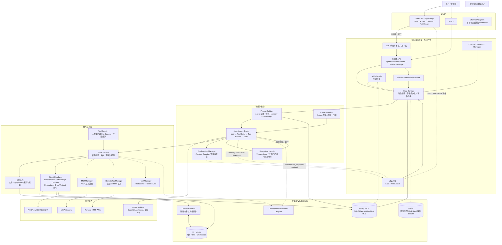
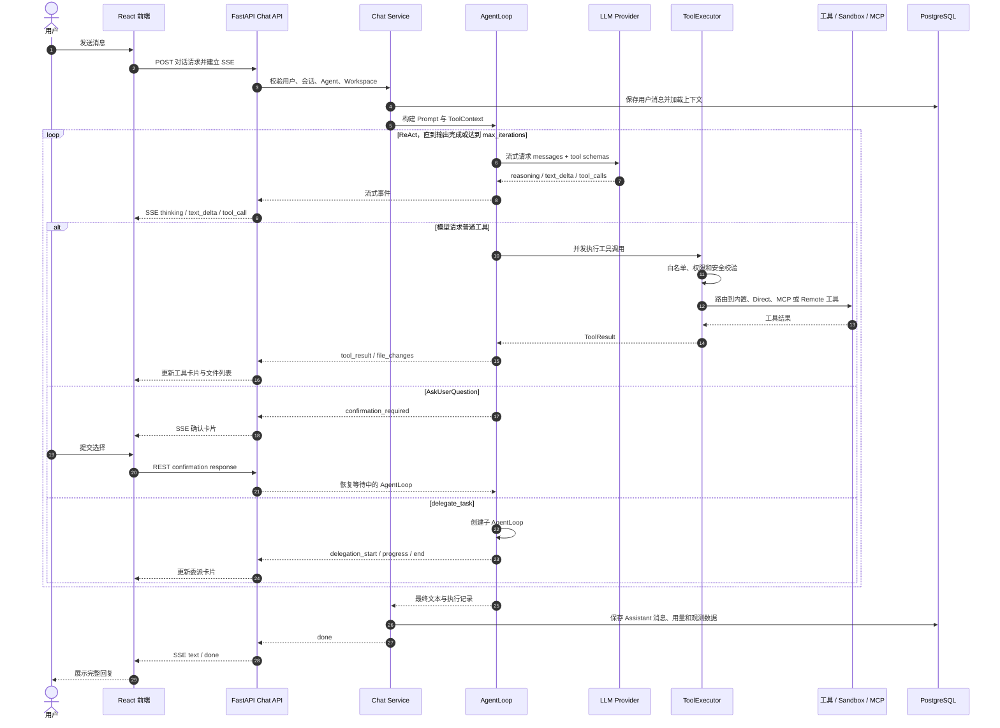
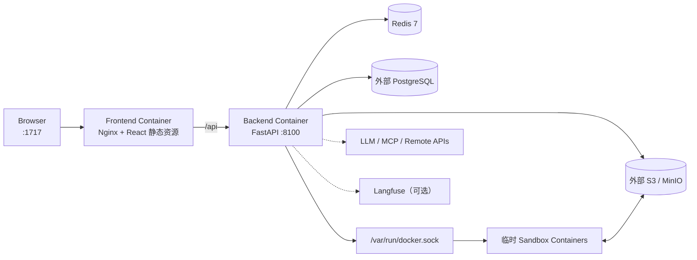

# AIO Agent Platform 架构图

> 本文基于当前仓库代码整理。实线表示同步调用或数据读写，虚线表示流式事件、异步任务或外部集成。

## 1. 系统总体架构

## 2. 单轮对话执行链路

## 3. 部署拓扑

## 4. 关键代码入口

| 关注点 | 代码入口 |
|---|---|
| 应用启动与依赖装配 | `backend/src/aio_agent_platform/interface/api.py` |
| 对话 API、SSE 与 WebSocket | `backend/src/aio_agent_platform/interface/routes/chat.py` |
| ReAct 执行循环 | `backend/src/aio_agent_platform/core/agent.py` |
| Prompt 与 AgentLoop 构建 | `backend/src/aio_agent_platform/core/chat.py` |
| 上下文窗口管理 | `backend/src/aio_agent_platform/core/context.py` |
| 工具注册与统一执行 | `backend/src/aio_agent_platform/tools/registry.py`、`tools/executor.py` |
| MCP 与远程 HTTP 工具 | `backend/src/aio_agent_platform/tools/mcp/`、`tools/remote/` |
| 多智能体委派 | `backend/src/aio_agent_platform/delegation/handler.py` |
| 用户确认流程 | `backend/src/aio_agent_platform/core/confirmation.py` |
| 记忆与知识 | `backend/src/aio_agent_platform/memory/`、`knowledge/`、`graph_knowledge/` |
| 数据模型与租户隔离 | `backend/src/aio_agent_platform/db/models.py`、`db/connection.py` |
| 前端路由与流式事件 | `frontend/src/App.tsx`、`frontend/src/hooks/useChatStream.ts` |
| 容器部署 | `docker-compose.yml` |
